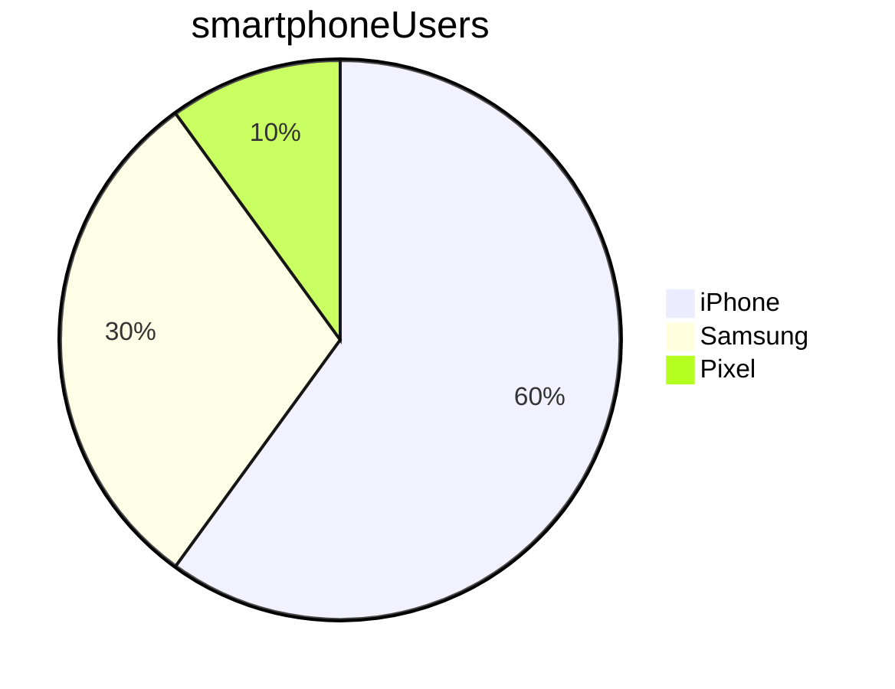

#learning about markdown

##how to do headings

Use more hashes for smaller headings 

### Example of a subheading of the subheading

## General formatting

_italics_

*this is also italics*

**Bold**

> To be on not to be, this is the question
> W.Shakespare

## lists

*item1
*item2
 *subitem1
  *sub-subitem1
  *sub-subitem1
 *subitem2
*item 3

## Numbered lists

Note: use when sequence/order is important

1. first item
   *bullet point1
   *bullet point2
2.second item
3.third item

##

links
to a website:
[Google](http://www.google.co.uk)

Links a folder/file in repo file [README.md](README.md)
## code

Inline code example:
To print something to the screen in Python, user the 'print()' for 

Example of code over multiple Lines:
```python
print('Hello')
print('Hello')
```


```
pwd
cd foldername
```

## Task list

- [] item not done yet
- [x] This item is done


# Tables

Name    |   Street   |  Town
--------|------------|----------
Cathy   | Main St    | Birmingham
John    | Maple Drive  | Stafford


# mermaid

